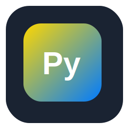
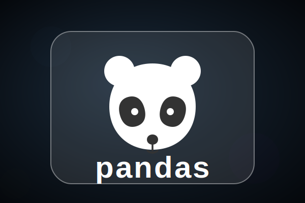

<!-- README.md — Joel Moirangthem (Grid Boxes + animated SVG icons) -->

# Moirangthem Joel Singh

👋 Hi — I'm **Joel Moirangthem**, a Computer Science Engineering student building useful tools, learning systems design, and exploring AI & web development. I love turning ideas into working software and learning by shipping projects.

---

## 💫 About Me
I enjoy experimenting with code, learning new technologies, and slowly shaping my skills into something meaningful. Most days you'll find me debugging, learning, or building side projects to grow as a developer.

---

## 🔧 Tech Stack (Grid — animated icons)
> Hover icons in browsers to see subtle animations. Place these SVGs in `/assets/` for best results.

|    **Python** |    **JavaScript** |    **Java** |    **React.js** |
|---:|:---:|:---:|:---:|
|    **Next.js** |    **Node.js** |    **Express.js** |    **MySQL** |
|    **MongoDB** |    **Pandas** |    **NumPy** |    **Matplotlib** |
|    **Google Cloud** |    **HTML5** |    **CSS3** |    **Git** |

---

## 📂 Projects (short)
- **Portfolio Website** — personal portfolio & project gallery · *Next.js, React.js*  
- **Student Management System** — college project for records · *Java, MySQL*  
- **Data Analysis Toolkit** — dataset processing & visualization · *Python, Pandas, Matplotlib*  

---

## 🎓 Education
- **B.Tech** — Computer Science Engineering

---

## 📈 GitHub & Stats

---

## 🏆 GitHub Trophies

---

## ✉️ Contact
- Email: joelmoirangthem1@gmail.com  
- Phone: 9863096861  
- LinkedIn: https://www.linkedin.com/in/joel-moirangthem-494119315/  
- GitHub: https://github.com/JoelMoirangthem

---

## ⚙️ Repo setup notes
- Place all SVG files in `assets/` at repo root.
- Use the README as-is — GitHub will fetch `/assets/*.svg` when rendering images.
- If an animated SVG appears static in some GitHub views, open the repo in a browser or check `preview.html` locally to verify animations.

